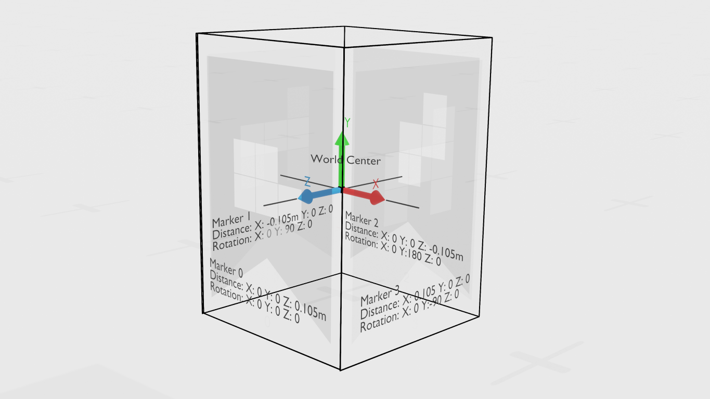

# Spatial Calibration 

## Overview

Spatial calibration is the process of determining where the cameras in a capture setting are located. This is important for multi-camera setups, so that we can stitch the independent camera views into one coherent image. If you haven't calibrated multi-camera setups before, we recommend that you start with the quick calibration before going to the advanced calibrations.

---

## Quick Calibration

This is the easiest way to calibrate your cameras, both in terms of hardware and software setup. It's ideal for most capture configurations with 1-3 sensors, where the maximum angle between the sensors doesn't exceed 120°, like in the example above. If you want to capture a full volumetric scene from all sides, please see the advanced calibration section. 

#### Making the marker
Print any one of the 6 markers in your desired size. The markers can be found in the folder:
>LiveScan3D / Docs / Calibration Markers / Prints

DinA4 or Letter size is the best allrounder size for most capture scenarios. Simply print the marker (best on sticker paper) and glue it onto a sturdy, straight piece of cardboard, wood, or acrylic glass. Make sure that the print is high in contrast, not too glossy and the support material is flat and does not bend.

#### Calibrating with  a single marker
When calibrating, make sure that the arrow on the marker "points" upwards, otherwise the scene might appear flipped. 

1. Place the marker into the view of the cameras, so that all sensors, both color and depth can see if fully. You can check this inside the Client window, by pressing the "Depth/Color" button to change the view.

2. Connect all clients to the server and press the "Calibrate" button. All clients now try to detect the marker and calibrate their position. When a sensor has successfully calibrated, the client preview window shortly shows a green outline around the marker and the "Calibration" status in the client list should change from "False" to "True".

**If your calibration fails**, please see the troubleshooting section down below. Don't give up, calibration is a bit of a tricky process, and it might need a few tries until it works.

---

## Advanced Calibration

### Refine Calibration
When you have made an successful initial calibration with a marker, you can optionally try to refine the calibration with the _Refine Calibration_ button. Calibration refinement is based on an ICP-algorithm. This algorithm looks for similarities between the cameras views and then tries to match the translation/rotation of each camera so that it gives a more coherent view. This also means however, that each cameras view needs to have a certain overlap with the other cameras. If your cameras don't have any, or few overlapping areas, this function might hurt your calibration more than it helps.
If there are some objects in the scene that all cameras can see, you can click on the _Refine Calibration_ button, and depending on your scene size, it can take between a few seconds to minutes to refine the calibration. If you see an improvement, you can click this button multiple times, to see if it further improves your calibration. If you want to reset your refined calibration, simply re-calibrate with a marker and the _Calibrate_ button.

>💡In our experience, it's best to have a large, thin object, like a broomstick in the view of all cameras. Then close the Bounding Box, so that only this object can be seen in the 3D-Preview window, and start the refinement.

### Multi-Marker calibration: Calibration Cube

The calibration cube is the most common way to calibrate sensor setups that view the scene from all angles. It should cover most use-cases and sensor setups, a custom marker configuration is only rarley needed. The cube requires more hardware and software setup than a single marker, but we provide you with detailed instructions on how to build and calibrate with your own cube.

**1: Choosing a cube configuration**
You can construct 4-sided and 5-sided versions of the cube. The only difference is that the 5-sided cube has an additional marker on top, which might come in handy if you want to point a camera from above down onto the capture scene. If you don't expect to capture in this way, the 4-sided version is easier and cheaper to make. The 4-sided version is ideally suited for human performance capture, the 5-sided version is usually only needed in special scenarios.

**2: Choosing the right format**
- **DinA4** or Letter size is the best allrounder size for most capture scenarions and should also be the most widely available printing format. (Capture of people interacting with medium- smaller objects)
- **DinA3** is recommended for large capture setups, where the distance between the cameras and the markers exceed 3-4 meters (Capture of large rooms, objects or multiple people)
- **DinA5/A6** can be used for close-up shots, where the distance from camera to marker is closer than 1m. (Close up shots/portraits, table-scenes, animals)
- **DinA7** is needed for setups with the minimal distance of 30cms or less between camera and marker. (Capturing hands, small animals or objects)

**3a: Making the cube by 3D Printing**

The most common and easiest way to construct your cube is to 3D-Print it. You can find ready-to-print .stl files at the path below, simply choose your size and flavor, and load it into your slicer, or upload it to your 3D-Printing service provider:

>LiveScan3D / Docs / Calibration Markers / Calibration Cube / STLs

**3b: Making the cube by Cutting & Glueing**

For sizes DinA4/Letter and above, it might also be cheaper to make your cube by cutting wood/plastic sheets and gluing them together. For good calibration results, you need to cut with very precise measurements, we recommend using a laser cutter if you have access to one.

>📦 If you first want to try this calibration method without commiting to expensive materials/tools, you can also fabricate a calibration cube out of cardboard. However, this material is prone to bending and deforming, so for production-level captures, use a cube made from sturdier materials.

For a 4-sided calibration cube, you need to cut out the following pieces. W refers to the width of your choosen format, H to the height of your choosen format and T to the thickness of your material. Width is always the shorter side of your format.

- 2x Long side pieces with the dimensions W x H
- 2x Short side pieces with the dimensions (W - 2 * T) x H  
- 1x Bottom piece with the dimension (W- 2 * T) x W

As an example for a DinA4 (210 x 297) sized 4-sided calibration cube, with a material that has a thickness of 5mm:

- 2x pieces of 210mm x 297mm
- 2x pieces of ( 200mm (210mm - 2 x 5mm) x 297mm)
- 1x piece of 210mm x 200mm

For a 5-sided calibration cube, you need to cut out these pieces:

- 2x long side pieces with the dimensions H x (H - T)
- 2x Short side pieces with the dimensions (W - 2 * T) x (H - T)
- 1x Top piece with the dimensions H x W

As an example for a DinA4 (210 x 297) sized 5-sided calibration cube, with a material that has a thickness of 5mm:

- 2x pieces of 297mm x 292mm (297mm - 5mm)
- 2x pieces of 200mm (210mm - 2 x 5mm) x 292mm (297mm - 5mm)
- 1x piece of 210mm x 297mm

Glue these pieces together on their edges like in this illustration:

4-Sided Calibration Cube:

5-Sided Calibration Cube:

**4: Attaching the markers**

Print out the markers you need (4-Sided: Markers 0-3, 5-Sided: Markers 0-4) on matt, heavy paper with a high contrast. The ink should not be too glossy. Ideally, print out the markers directly on matt sticker-paper, this will make it easier to attach the marker.

You can find the files ready to print in your size here:

>LiveScan3D / Docs / Calibration Markers / Prints

Now, glue the markers onto the cube like this:

- For the 4-sided cube, the "arrow" on the markers should always point away from the hollow side. Attach Marker 0 onto one side and then attach the other markers in ascending order in a clockwise direction around the cube. For example: North = 0, East = 1, South = 2, West = 3

- For the 5-sided cube, the "arrow" on the markers should also always point away from the hollow side. Then pick one of the short side pieces to attach Marker 0. Attach markers 1-3 like you would on the 4 sided cube. When attaching the markers to the long side pieces, make sure to place them exactly in the middle of the side. Now, glue Marker 4 on top of the cube, the arrow of this marker should point away from  Marker 0.

 <iframe title="LiveScan3D Calibration Cube Markers" frameborder="0" allowfullscreen mozallowfullscreen="true" webkitallowfullscreen="true" allow="autoplay; fullscreen; xr-spatial-tracking" xr-spatial-tracking execution-while-out-of-viewport execution-while-not-rendered web-share src="https://sketchfab.com/models/31aa616be603422489bc9e487337cdd4/embed"> </iframe> 
 <a href="https://sketchfab.com/3d-models/livescan3d-calibration-cube-markers-31aa616be603422489bc9e487337cdd4?utm_medium=embed&utm_campaign=share-popup&utm_content=31aa616be603422489bc9e487337cdd4" target="_blank" rel="nofollow" style="font-weight: bold; color: #1CAAD9;"> LiveScan3D Calibration Cube Markers </a> by <a href="https://sketchfab.com/ChrisRE?utm_medium=embed&utm_campaign=share-popup&utm_content=31aa616be603422489bc9e487337cdd4" target="_blank" rel="nofollow" style="font-weight: bold; color: #1CAAD9;"> ChrisRE </a> on <a href="https://sketchfab.com?utm_medium=embed&utm_campaign=share-popup&utm_content=31aa616be603422489bc9e487337cdd4" target="_blank" rel="nofollow" style="font-weight: bold; color: #1CAAD9;">Sketchfab</a>

**5: Calibrating in LiveScan**

1. Place the marker into the view of the cameras, so that all sensors, both color and depth can see if fully. You can check this inside the Client window, by pressing the "Depth/Color" button to change the view.

2. Open "More settings" and there click on "Load Poses". Go to the following path and open the .txt file matching your format. Close the "More Settings" window:
    
    >LiveScan3D / Docs / Calibration Markers / Calibration Cube / Poses

    

3. In the Main window of the server, click on "Calibrate". Wait until all clients have finished calibrating. You can check in the client list, if the "Calibrated" status is "True". If some clients don't calibrate, please take a look at the Troubleshooting section!

### Custom Multi-Marker setups
In some special cases, you might find that the calibration cube doesn't offer you the right calibration capabitlites and you want to create your own multi-marker setup. 

**1: Build your marker**
How you exactly build the multi-marker setup is up to you and your needs. There are however some rules that need to be followed.

- All markers in a multi-marker setup need to have the same size
- All markers have to be attached to a flat, rigid surface
- The connection between the markers needs to be rigid and stable
- Each camera/client can only see one marker. It will always choose the biggest marker in view
- Markers should always directly face the cameras for best calibration quality

**2: Measure your setup**
This is the tricky part of the multi-marker setup. After you've build your physical marker setup, you now need to very preciscly measure the positions and rotations of the markers.
In a LiveScan session, Livescan needs to know how far away each marker is from the world center of the scene in it's coordinate system. The world center has the coordinates of (X=0m, Y=0m, Z=0m) for position and of angles (X=0°, Y=0°, Z=0°) for rotation.
In your setup, you decide where the world center should be, and then measure the distance and rotations on all axis relative to it. In the calibration cube for example, it is located right in the middle of the cube. You can also decide that the first marker is at the world center, and measure the distance and angles of the other markers relative to it.

The calibration coordinate system in Livescan works as follows:

- Positions are measured in meters. If you want to enter a value of 22.1cm for example, you enter 0.221 into a field
- Rotations are measured in degree angles. Clockwise rotations are positive, counter-clock negative
- Livescan uses a Right-Handed Coordinate System (RHS)
    > ⬆️ When you hold a marker so that the "arrow" on it points upwards and you directly look onto it, the X-Axis goes to the right , the Y Axis goes up and the Z-Axis goes towards you

On the markers, there is a tiny crosshair in the middle, which shows the center point of the marker, where you need to measure from. The small lines at the middle of the edges are aligned to the center, to help you measure. The following illustration is an example of how to the DinA4 sized (297cm x 210cm) calibration cube is being measured:

**3: Enter the measurements into LiveScan**

When you have obtained the position and rotations measurements of all your markers on all axis, you are now ready to enter them into LiveScan. 

- In the LiveScan Server window, go to "More Settings" and choose the marker for which you want to enter your coordinates
- Enter your angles into the "Rotation X Y Z" fields and your distances/positions in meters in the "Translation X Y Z" fields
- Repeat for all markers in your setup
- When you're done, click on the "Save Poses" button to save your calibration to a file. LiveScan remembers your calibration values between session, but should you use another setup in between or the values got lost, you can now always easily restore them using the "Load Poses" buttom.
- In the LiveScan Server main window, click on "Calibrate". When all clients have calibrated successfully, but your calibration looks off, you can adjust the Translation/Rotation values in the "More settings" window for each marker. After you've changed a value, the calibration will be instantly updated in the preview window, you don't need to click on "Calibrate" again. 

---

## Troubleshooting
The calibration process can unfortunately be very tricky and frustrating. You sometimes need to be very patient until a calibration works. Below, we've collected a few tips and tricks on how to get LiveScan to recognize your marker, and help with common questions.

**LiveScan doesn't detect markers**
This issue is very common and has multiple causes. Please ensure that the following conditions apply to your markers/environment.

Markers:
- The markers are printed on a matte paper and the ink is not too glossy
- The markers are solidly attached to a very flat and rigid surface, that is not bended
- You can see all of the marker in each client's window from both the depth and color view
- The marker faces the camera/sensor directly, and is not turned away more than 45° from it
- The marker is not too close (<40cm) or too far (>4m) from the camera
- Experiment with different rotatations and positions of the markers, try turning/moving them a bit 

Enviroment:
- Ensure to have a well-lit environment, that doesn't contain any direct sunlight (strong IR-light messes with the depth sensor)
- Ensure there are no other IR-sources (Vive basestations, Ultraleap sensor, other depth sensors) in the scene
- Try turning your lights on and off while the calibration is running. Sometimes this helps the sensors to recognize the markers better
- Ensure that the lights in your environment don't cause any lens flares on the sensors
- Remove any other printed markers that you may have lying around in your scene
- Experiment with different light conditions and intensities

**LiveScan draws a green outline around a marker, but is not calibrating**
You're halfway there! This means the color camera can see the marker, but the depth camera can not. This is usually caused by the marker being too far away or too close to the sensor. Try moving the marker around.
Sometimes this issue can also be caused by too much IR-light in the enviroment. See the tips from the issue above.

**LiveScan draws a green outline around one marker and a red one around another**
This means that LiveScan can see both markers, but chooses the one with the green outline for calibration, because it is the bigger one (from the point of view of the sensor). If that is the marker your sensor should use, you don't need to change anything. If you want the sensor to use the marker with the red outline, get it closer to the sensor or lower it's relative angle, or remove the marker with the green outline by blocking it.

**My custom markers have an offset after calibrating**
This is probably caused by a measurement issue with the markers. Try adjusting the XYZ values for both rotation and position in the "More settings" windows for each marker and play around with them a bit. The calibration will be updated in real-time in the preview, to reflect your changes.

**"Refine Calibration" made my calibration look worse**
This probably means that you have to little overlap between your sensors views, or that the objects in your scene are not seen by every camera. It can be helpful to let the algorithm focus on just one specific part of your scene, which can be seen by all sensors, instead of the full scene. To do this. decrease the Bounding Box size, so that only the focused part of the scene can be seen in the 3D-Preview, and then try the refinement again.